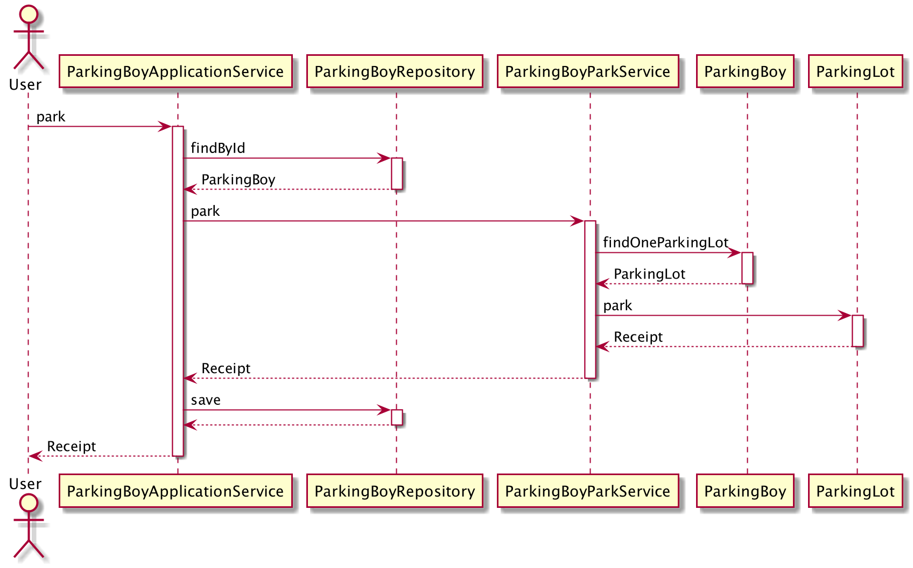
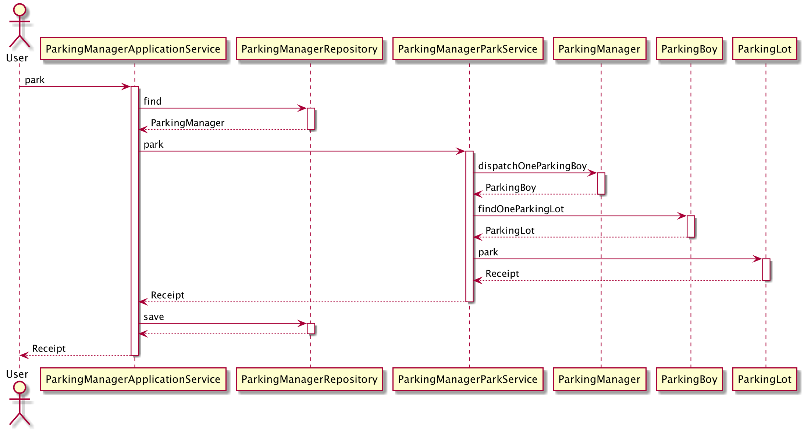
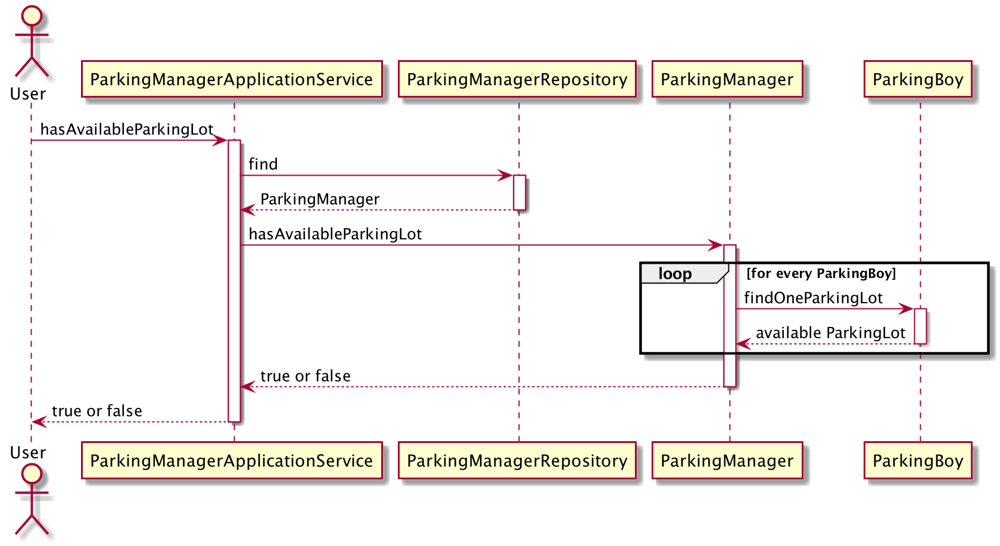

= Parking Lot

image::https://github.com/kbyyd24/parking-lot-modling/workflows/parking-lot/badge.svg[link="https://github.com/kbyyd24/parking-lot-modling/actions"]

== How to run

Use cases are written as test cases, run gradle test can see the result:

[shell]
----
> gradle test
----

Also, added a groovy script to run the user journey, you can run the script:

[shell]
----
> gradle runJourney
----

== UML

image::Uml.png[]

UML code:

//include::UML.puml[]

== Sequence Diagrams

Only for application service

=== ParkingBoyApplicationService.park

UML code:

include::ParkingBoyApplicationService.park.puml[]

=== ParkingManagerApplicationService.park

UML code:

include::ParkingManagerApplicationService.park.puml[]

=== ParkingManagerApplicationService.hasAvailableParkingLot

UML code:

include::ParkingManagerApplicationService.hasAvailableParkingLot.puml[]