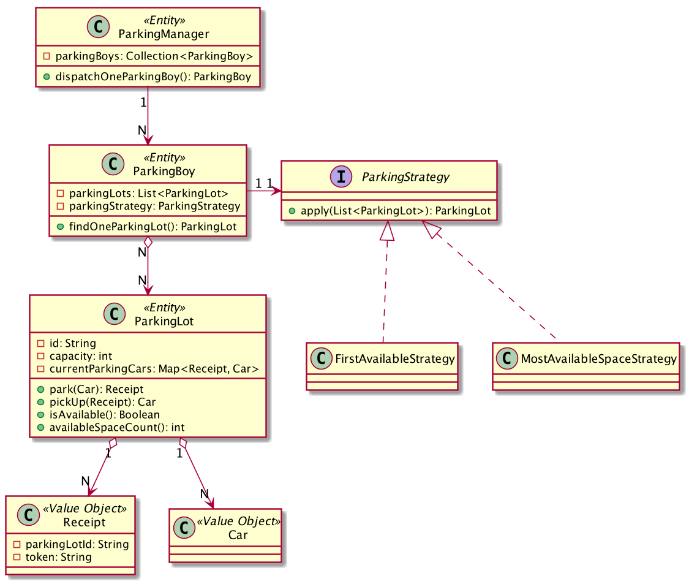

= Parking Lot

image::https://github.com/kbyyd24/parking-lot-modling/workflows/parking-lot/badge.svg[link="https://github.com/kbyyd24/parking-lot-modling/actions"]

== UML

Plant UML code:

include::PlantUml[]

== How to run

Use cases are written as test cases, run gradle test can see the result:

[shell]
----
> gradle test
----