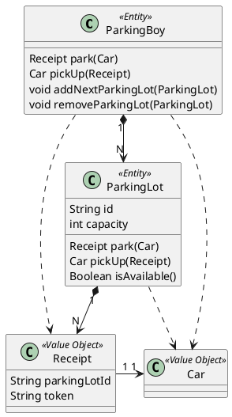

 Parking Lot
---


## UML


```plantuml
@startuml

class ParkingBoy <<Entity>> {
  Receipt park(Car)
  Car pickUp(Receipt)
  void addNextParkingLot(ParkingLot)
  void removeParkingLot(ParkingLot)
}

class ParkingLot <<Entity>> {
  String id
  int capacity
  Receipt park(Car)
  Car pickUp(Receipt)
  Boolean isAvailable()
}

class Receipt <<Value Object>> {
  String parkingLotId
  String token
}

class Car <<Value Object>>

ParkingLot "1" *--> "N" Receipt

Receipt "1" -> "1" Car

ParkingBoy "1" *--> "N" ParkingLot

ParkingBoy ..> Receipt

ParkingBoy ..> Car

ParkingLot ..> Car

@enduml
```

## How to run

Use cases are written as test cases, run gradle test can see the result:

```shell script
> gradle test
```